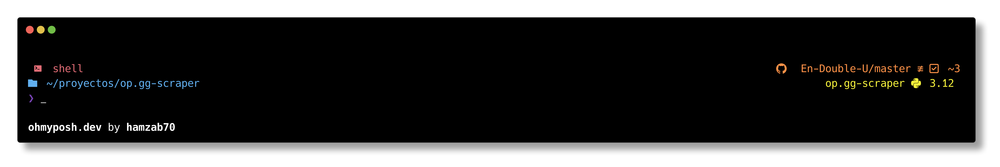

# .dotfiles
A backup of all my dotfiles, shell configurations and themes based on ZSH and other awesome tools.

## Requirements

* git
* zsh
* stow
* [fzf](https://github.com/junegunn/fzf?tab=readme-ov-file#installation)
* [oh-my-posh](https://ohmyposh.dev/docs)
* [Hack Nerd Font Regular](https://github.com/ryanoasis/nerd-fonts/releases/download/v3.2.1/Hack.zip)

## Optional Software

* [lazydocker](https://github.com/jesseduffield/lazydocker#installation)
* [lazygit](https://github.com/jesseduffield/lazygit?tab=readme-ov-file#binary-releases)
* [zellij](https://zellij.dev/documentation/installation)

## Installation

### Before starting install the required packages

Go to the $HOME directory
```
cd ~
```
Clone this repository
```
git clone https://github.com/hamzab70/.dotfiles.git
```
Enter the repository and execute stow to symlink the files to your $HOME directory
```
cd .dotfiles
stow . # in case you need to replace files just accept
```

## Result


